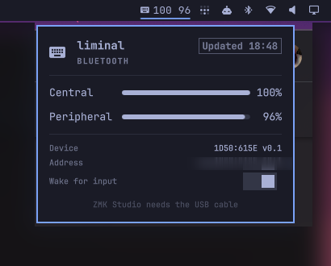

# omarchy-zmk

Battery and connection status for a ZMK keyboard in the
[Omarchy](https://omarchy.org/) bar. It shows whether the board is talking
over Bluetooth or USB, the battery of each piece of a split, which piece
is charging, and a popup with the details.

Design notes are in [ARCHITECTURE.md](ARCHITECTURE.md). MIT licensed.



## Install

```bash
omarchy plugin add https://github.com/ashmortar/omarchy-zmk.git --enable
```

## Requirements

Everything here ships with a stock Omarchy install:

- BlueZ, which the plugin talks to over D-Bus with `busctl`
- `jq`, to read the D-Bus replies
- `python3`, for the small evdev reader that watches which link your
  keystrokes arrive on
- your user in the `input` group (Omarchy's default), or that reader
  can't open the keyboard's event nodes

The script checks for `jq`, `busctl`, and `timeout` at each run and
reports a missing one in the popup instead of guessing. It reads nothing
from the environment: binaries come from `/usr/bin` only, never from your
shell's PATH, and its state lives under `/run/user/<uid>/omarchy-zmk/`,
which it uses only while that directory is private to you.

## Usage

The bar shows a keyboard icon. It's the theme accent color on USB, the
normal bar color on Bluetooth, dimmed when the board is asleep, and
urgent when a battery is low.

| State | Popup |
|---|---|
| Bluetooth | A battery row per piece with a drain estimate, device details, and a wake toggle |
| Wired | The same, plus a link to ZMK Studio. Battery rows need the Bluetooth link too, since ZMK doesn't expose battery over USB |
| Not connected | When the board was last seen, and a Connect Bluetooth button |
| No board found | What to do about it |
| Error | What failed: the status script, BlueZ, or an action |

Left click opens the popup, right click toggles percentages in the bar,
middle click refreshes. Inside the popup: Esc closes, Tab moves to the
next panel, R connects Bluetooth, W toggles wake, P toggles percentages,
S opens ZMK Studio.

Two things worth knowing. "Connection" means the path your keystrokes
actually take. If both USB and Bluetooth are up, the widget reports
whichever one carried the last key you pressed, so toggling ZMK's output
shows up after your next keystroke. And battery is read live every
refresh, never cached, so a sleeping keyboard says Not connected instead
of showing a stale number.

## Configure

Nothing is required. With one ZMK board paired, the widget finds it by
ZMK's vendor and product id. Settings go inline on the bar entry in
`~/.config/omarchy/shell.json`:

```json
{ "id": "ashmortar.zmk", "refreshIntervalSec": 10, "lowThreshold": 15 }
```

| Key | Default | What it does |
|---|---|---|
| `refreshIntervalSec` | 10 | How often to poll, 10 to 600 seconds |
| `lowThreshold` | 15 | At or below this percent a battery turns urgent and you get one notification |
| `macAddress` | empty | Leave empty to pick the connected ZMK board, or any paired one; set it to pin a specific board |
| `usbId` | `1D50:615E` | ZMK's vendor and product id, either case; change it only for a custom id |
| `deviceName` | empty | Name to show until the board has been seen |
| `showPercent` | false | Percentages in the bar; right click toggles it |

## Remove

```bash
omarchy plugin disable ashmortar.zmk   # take it off the bar, keep the files
omarchy plugin remove ashmortar.zmk    # delete the plugin
```

Outside its own directory the widget writes two things: runtime state
under `/run/user/<uid>/omarchy-zmk/`, which the system clears at logout,
and its own bar entry in `~/.config/omarchy/shell.json` when you
right-click to toggle percentages.

## How it works

A bash script, `script/zmk-status`, reads everything from BlueZ, sysfs,
and the keyboard's evdev nodes and prints one line of JSON. The widget
runs it every `refreshIntervalSec` seconds. There's no daemon, and
nothing runs in the background except a keystroke reader that `timeout`
kills at the end of each interval. The reasoning behind all of that is in
[ARCHITECTURE.md](ARCHITECTURE.md).

The script stands on its own too, if you want it for Waybar or a
terminal:

```bash
~/.config/omarchy/plugins/ashmortar.zmk/script/zmk-status | jq .
```

## IPC

```bash
omarchy-shell ashmortar.zmk toggle        # also open / close
omarchy-shell ashmortar.zmk refresh
omarchy-shell ashmortar.zmk reconnect
omarchy-shell ashmortar.zmk togglePercent
omarchy-shell ashmortar.zmk status        # the raw JSON
```

## Limitations

- After you toggle ZMK's output with both links up, the status changes
  on your next keystroke, so it can lag by up to one refresh interval.
- A dongle build is USB-only from the host's side, so it reads as wired
  with no battery. ZMK doesn't send battery over USB.
- With more than one peripheral, the host can't tell which one is on the
  cable. The popup says "cable on a peripheral" and leaves it at that.
- The host can't see which physical side is the central, so the labels
  are Central and Peripheral rather than left and right.
- One widget per bar in this release. The shell keys inline settings and
  IPC by plugin id, so a second instance can't be told apart.
- Keystroke sampling covers at most 60 seconds of each refresh interval.
  At long intervals the both-links-up case mostly reports wired.
- With several ZMK boards connected at once, you get the first one in
  BlueZ's path order unless `macAddress` pins one.

## License

MIT, see [LICENSE](LICENSE).
